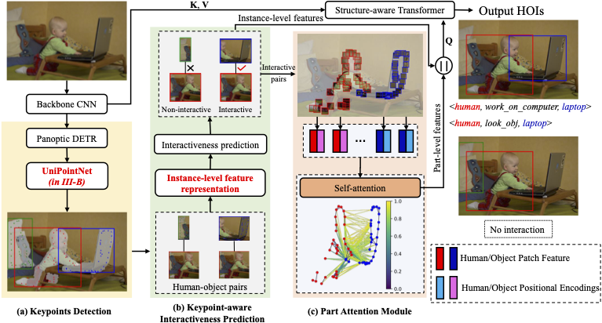

# GeoHOI

### Geometric Features Enhanced Human-Object Interaction Detection



Cameras are essential vision instruments to capture images for pattern detection and measurement. Human-object interaction (HOI) detection is one of the most popular pattern detection approaches for captured human-centric visual scenes. Recently, Transformer-based models have become the dominant approach for HOI detection due to their advanced network architectures and thus promising results. However, most of them follow the one-stage design of vanilla Transformer, leaving rich geometric priors under-exploited and leading to compromised performance especially when occlusion occurs. Given that geometric features tend to outperform visual ones in occluded scenarios and offer information that complements visual cues, we propose a novel end-to-end Transformer-style HOI detection model, i.e., geometric features enhanced HOI detector (GeoHOI). One key part of the model is a new unified self-supervised keypoint learning method named UniPointNet that bridges the gap of consistent keypoint representation across diverse object categories, including humans. GeoHOI effectively upgrades a Transformer-based HOI detector benefiting from the keypoints similarities measuring the likelihood of human-object interactions as well as local keypoint patches to enhance interaction query representation, so as to boost HOI predictions. Extensive experiments show that the proposed method outperforms the state-of-the-art models on V-COCO and achieves competitive performance on HICO-DET. Case study results on the post-disaster rescue with vision-based instruments showcase the applicability of the proposed GeoHOI in real-world applications.

The UniPointNet has been integrated into GeoHOI for end-to-end HOI detection. Please check out our other repository [here](https://github.com/zhumanli/UniPointNet) for independent use. 

# Setup
### Setup environment
```
conda create -n GeoHOI python=3.8
conda activate GeoHOI
pip install -r requirements.txt
```
### HOI dataset
Please refer to [STIP](https://github.com/zyong812/STIP) for V-COCO and HICO-DET preparation.

# Training/Testing on V-COCO
```
CUDA_VISIBLE_DEVICES=0,1 python GeoHOI_main.py --validate --epoch 30 --num_hoi_queries 32 --batch_size 8 --num_kp 32 --lr 5e-5 --HOIDet --hoi_aux_loss --no_aux_loss --dataset_file vcoco --data_path v-coco --detr_weights https://dl.fbaipublicfiles.com/detr/detr-r50-panoptic-00ce5173.pth --output_dir checkpoints/vcoco --run_name vcoco
```

# Training/Testing on HICO-DET
```
CUDA_VISIBLE_DEVICES=0,1 python GeoHOI_main.py --validate --epoch 30 --num_hoi_queries 32 --batch_size 8 --num_kp 32 --lr 5e-5 --HOIDet --hoi_aux_loss --no_aux_loss --dataset_file hico-det --data_path hico_20160224_det --detr_weights https://dl.fbaipublicfiles.com/detr/detr-r50-panoptic-00ce5173.pth --output_dir checkpoints/hico-det --run_name hico-det
```

# Citing
If you find this work useful, please consider our paper to cite:
```
@ARTICLE{zhu24geometric,
  author={Zhu, Manli and Ho, Edmond S. L. and Chen, Shuang and Yang, Longzhi and Shum, Hubert P. H.},
  journal={IEEE Transactions on Instrumentation and Measurement}, 
  title={Geometric Features Enhanced Human–Object Interaction Detection}, 
  year={2024},
  volume={73},
  number={},
  pages={1-14},
  keywords={Transformers;Feature extraction;Visualization;Detectors;Semantics;Instruments;Shape;Attention mechanism;graph convolutional network (GCN);human-object interaction (HOI);interactiveness learning;object keypoints},
  doi={10.1109/TIM.2024.3427800}}
}
```
# Acknowledgements
We would like to express our gratitude to the open-source project [STIP](https://github.com/zyong812/STIP) and its contributors since our framework is heavily built on it.

